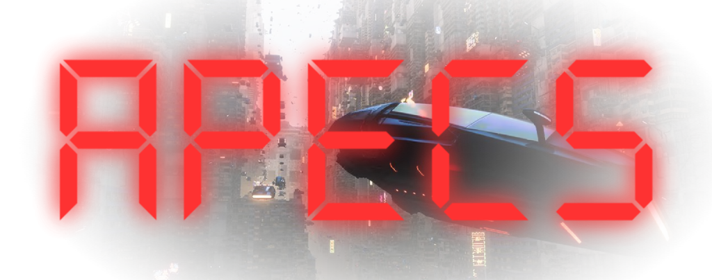

<p align="center"></p>

<br>
<p align="center">
  <a style="text-decoration:none">
    
  </a>  
  <a style="text-decoration:none">
    
  </a>
  <a style="text-decoration:none">
    
  </a>
</p>

**A**rchetypal **P**arallel **E**ntity **C**omponent **S**ystem is a ECS for Unity with archetype chunk storage, type-safe queries, deferred command buffers and transient events. Uses **Burst**, **Jobs**, and **Collections** only, no `com.unity.entities`.

<p align="center"><b>⚠️Still In Early Development ⚠️<b/></p>

## Features

- **Archetype chunks**: entities grouped by `ComponentMask`, components stored in `NativeList<T>` per type (128 entities per chunk).
- **Type-safe queries**: `QueryBuilder` → `ref struct QueryIterator<T...>` with in-place `ref` access (up to 8 components).
- **Deferred structural changes**: `CommandBuffer` + `CommandBufferSystem` flush at `Phase.PostUpdate`; provisional entities supported within one buffer.
- **Transient events**: double-buffered `EventQueue<T>` with `EventWriter` / `EventReader` (one-frame latency by default).
- **System scheduler**: `[UpdateInPhase]`, `[UpdateAfter]` / `[UpdateBefore]`; reflection only at startup.
- **Unity integration**: `WorldBootstrap` `MonoBehaviour` ticks phases from `Update` / `FixedUpdate` / `LateUpdate` and URP `PreRender`.

## Requirements

- Unity **6000.3 LTS** or newer
- `Unity.Burst`, `Unity.Collections`, `Unity.Mathematics`, `Unity.Jobs`
- `allowUnsafeCode: true` (already set on `FronkonGames.APECS.asmdef`)

## Quick start

1. Add a **World Bootstrap** component to a scene GameObject (`FronkonGames.APECS.WorldBootstrap`).
2. Register component store factories once (bootstrap or custom host).
3. Author systems with `[UpdateInPhase]`, auto-discovered when `autoDiscoverSystems` is enabled.
4. Register **`CommandBufferSystem`** and set `world.CommandBufferSystem` before using `Commands` (auto-discovery handles this in typical setups).

```csharp
using FronkonGames.APECS;
using Unity.Mathematics;

public struct Position { public float3 Value; }
public struct Velocity { public float3 Value; }

// Bootstrap (e.g. in a MonoBehaviour Awake after WorldBootstrap has run):
world.RegisterStoreFactory<Position>();
world.RegisterStoreFactory<Velocity>();

[UpdateInPhase(Phase.Update)]
public sealed class MovementSystem : SystemBase
{
  protected override void Update()
  {
    var iter = Query().With<Position>().With<Velocity>().Build<Position, Velocity>();
    while (iter.MoveNext())
    {
      ref Position p = ref iter.Current.t;
      ref Velocity v = ref iter.Current.u;
      p.Value += v.Value * DeltaTime;
    }
  }
}
```

**Structural changes** (spawn, despawn, add/remove components) go through `Commands`, not the world, while iterating:

```csharp
Commands.DestroyEntity(e);
Entity bullet = Commands.CreateEntity(ComponentMask.Of<Position, Velocity>());
Commands.SetComponent(bullet, new Velocity { Value = new float3(0, 0, 10) });
```

## Runtime layout

```
Runtime/
  Core/          World, Entity, ComponentMask, Archetype, ArchetypeChunk, ArchetypeStorage
  Storage/       SparseSet, ComponentStore<T>, IComponentStore
  Query/         QueryBuilder, QueryFilter, QueryIterator<T...>
  Commands/      CommandBuffer, CommandBufferSystem
  Events/        EventQueue<T>, EventWriter<T>, EventReader<T>
  Systems/       ISystem, SystemBase, SystemScheduler, Phase, attributes
  Resources/     ResourceContainer, WorldTime
  Bridge/        WorldBootstrap
```

## What it is / is not

| Good fit | Use something else |
|---|---|
| High-throughput local simulation (particles, crowds, boids) | You need Unity DOTS / Entities, baking, subscenes |
| ECS inside a classic Unity project | NetCode, ghost replication |
| Readable, fork-friendly runtime (~30 source files) | Custom editor, entity debugger, rendering pipeline |

## Samples

TODO.

## Support

Questions or bugs: **fronkongames@gmail.com**
